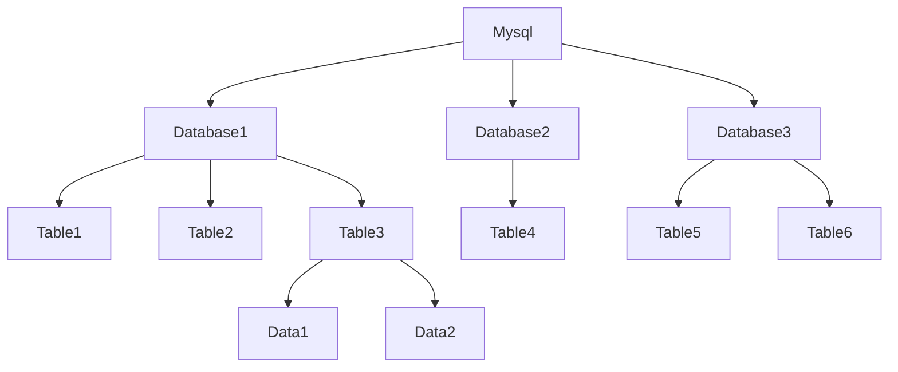

在开始讨论Mysql的基本操作之前我们需要先明确主体，即我们操作的是什么？下面我们忽略一些具体细节来了解一下Mysql这款数据库管理数据的结构和单元。



通过上图我们了解到Mysql可以管理多个数据库，每一个数据库又可以管理多个表，表里又管理了千千万万的数据；我们使用Mysql操作的就是数据库，数据库中的表格以及表格当中的数据。

接下来我们需要学习的内容围绕下面的5个问题：

1. 如何创建一个数据库？
2. 如何创建一个表？
3. 如何在表中创建数据？
4. 如何从表中检索数据？
5. 如何操作多个表？

# 如何创建一个数据库？

使用*create*命令用来创建数据库，命令格式为：
```
create database 数据库名称;
```

如果我们想创建一个test的数据库我们可以写：
```
create database test;
```
这样我们就创建了一个名称为test的数据库了
后面我们会发现*create*命令不仅可以创建数据库，还可以创建表以及一些其他东西。

## 如何查看刚刚创建的数据库呢？
我们可以先使用*show*命令用来查看现在Mysql都管理了哪些数据库。

```
mysql> show databases;
+----------+
| Database |
+----------+
| mysql    |
| test     |
| tmp      |
+----------+
```

*show*这个命令就如同字面翻译一样，显示，显示什么？ 显示databases，显示数据库，在后面我们会多次使用show这个命令。命令当中的数据库这个英文单词是复数形式，意味着显示很多数据库。（如果输入单数形式的database会显示错误，因为就没有这条命令，这里的提示只是为了方便记忆和理解）最后像其他大部分语言一样，命令语句结束以后要加一个分号用以表示命令输入完了。
如果你输入的命令有误Mysql会提示如下错误：
```
ERROR 1064 (42000): You have an error in your SQL syntax; check the manual that corresponds to your MySQL server version for the right syntax to use near 'database' at line 1
```
这意味着我们的命令语法错误了，不符合Mysql的语法规则。错误会告诉我们错误的地方大概在哪里。

## 使用数据库

创建好数据库以后我们还要让mysql知道我们当前要操作的是那个数据库。使用*use*命令来告诉mysql我们正在操作的数据库是哪一个。语法为*use 数据库名称;*
```
use test;
```
这样mysql就会知道我们当前正在操作的数据库是test数据库，方便后续的命令执行。
如果没有使用*use*命令去创建数据库，mysql会返回给我们一个错误提示：
```
mysql> create table test;
ERROR 1046 (3D000): No database selected
```
错误1046没有数据库被选择。

# 如何创建一个表？

在创建表之前我们要先简单的了解下表的构成。我们以下面这张表举例子

| name | owner | species | sex | birth | death |
| ---- | ---- | ---- | ---- | ---- | ---- |  
| Fluffy | Harold | cat | f | 1993-02-04 |  |
| Bowser | Diane | dog | m | 1979-08-31 | 1995-07-29 |

正如我们在数学课上学习到的那样，一个表格由行和列组成，其中表头即宠物名称（name）,主人（owner）,物种（species）,性别（sex）,出生日期（birth）,死亡日期（death）在mysql当中我们称之为字段。表头之外的每一行就代表一行数据。我们可以在每一行的字段（单元格）当中设置什么样的数据，取决于我们对该字段定义什么样子的字段数据类型。计算机不能直接理解人类语言，所以我们要对人类语言的信息进行数据分类，比如日期，数字，字符这样的分类，我们就称之为数据类型。

现在我们对表的结构有一定的了解以后就可以开始创建表了。
涉及到创建的命令我们马上想到的就是*create*命令。创建表和创建数据库的命令大同小异语法为*create table 表明 (字段名称 字段数据类型（显示长度）……)*
比如我们创建一个pet表，表当中涉及的字段属性包括宠物名称（name）,主人（owner）,物种（species）,性别（sex）,出生日期（birth）,死亡日期（death）：
```
CREATE TABLE pet (name VARCHAR(20), owner VARCHAR(20),species VARCHAR(20), sex CHAR(1), birth DATE, death DATE);
```
注：mysql的命令是不区分大小写的，所以大写的CREATE和小写的create是一样的。

通过上面的命令我们就可以创建一个pet宠物表。表中包含若干字段，比如name，我们设定的字段类型就是varchar表示的是字符类型，字符类型可以存储文字语言，字段类型后面还有一个括号，括号里面的值表示的是显示的长度，比如int(2),整数类型显示长度2，表示不管你的数值是多少，最少可以看到两个数字。假如你存的数值的3，没有满两位，就会在前面补零。假如你的数值是150，超过了显示宽度，则直接显示原始值，不做补零操作。

## 如何查看刚刚创建的表

我们可以通过*show*命令来查看我们刚刚创建的表：
```
mysql> show tables;
+----------------+
| Tables_in_test |
+----------------+
| Tickets64      |
| channel        |
| pet            |
| user_relation  |
+----------------+
4 rows in set (0.00 sec)
```
和查看数据的命令十分类似，我相信你已经发现其中的关系了。

# 如何在表中创建数据？

有两个命令可以用来在表中创建数据*LOAD DATA*和*INSERT*

## LOAD DATA命令导入数据

LOAD DATA可以把文件当中的数据导入到表格当中。

首先我们创建一个文件pet.txt
````
Fluffy  Harold  cat     f       1993-02-04      \N
Claws   Gwen    cat     m       1994-03-17      \N
Buffy   Harold  dog     f       1989-05-13      \N
Fang    Benny   dog     m       1990-08-27      \N
Bowser  Diane   dog     \N      1979-08-31      1995-07-29
Chirpy  Gwen    bird    f       1998-09-11      \N
Slim    Benny   snake   m       1996-04-29      \N
````
其中按照空格区分数据字段的，*\N*表示的null，如果这个字段没有数据可以用null表示。

然后我们进入mysql,使用*LOAD DATA*语法载入pet.txt的数据

```
LOAD DATA LOCAL INFILE '/home/ppmoon/pet.txt' INTO TABLE pet;
```

我们先简单解析下命令语法，*LOAD DATA*表示载入数据，载入什么地方的数据？LOCAL表示载入当前客户端所在的电脑的数据。因为你的mysql服务端很有可能是在远程服务器上的。如果在语句当中去掉LOCAL，载入数据的位置就是mysql服务端所在的电脑上的位置。*INFILE*指的是导入文件，还有一个命令是*OUTFILE*是导出数据。*INFILE*命令后面就是文件存放的路径了，这部分路径是linux系统的文件路径。如果是Windows假设你的文件在d盘可以写成*d:\pet.txt*最后*INTO*表明数据导入的方向*TABLE*表示数据插入到表中，不是别的地方，表的名字是什么？是pet。

## INSERT命令插入数据

除了LOAD DATA之外我们还可以使用*INSERT*命令插入数据。语法格式为：
```
INSERT INTO 表明 VALUES ('字段1','字段2'……);
```

如果我们想向pet表当中插入一条新数据，我们可以这样写：
```
INSERT INTO pet VALUES ('Puffball','Diane','hamster','f','1999-03-30',NULL);
```
VALUES当中的字段顺序和表当中的字段顺序一一对应即可，如果没有数据可以使用NULL占位。至此你一定发现了，mysql的命令几乎就是和英文直译是一样的，稍加理解参照手册就可以学会。

# 如何从表中检索数据？

使用*SELECT*命令来查看数据，语法格式为*SELECT 字段名 FROM 表名*，select英文直译挑选的意思，选择后面加上需要挑选的字段，也就是表格的列，如果要挑选出所有就使用*来表示。最后通过 from 命令来表明挑选那个表格当中的数据。

```
mysql> select * from pet;
+--------+--------+---------+------+------------+------------+
| name   | owner  | species | sex  | birth      | death      |
+--------+--------+---------+------+------------+------------+
| Fluffy | Harold | cat     | f    | 1993-02-04 | NULL       |
| Claws  | Gwen   | cat     | m    | 1994-03-17 | NULL       |
| Buffy  | Harold | dog     | f    | 1989-05-13 | NULL       |
| Fang   | Benny  | dog     | m    | 1990-08-27 | NULL       |
| Bowser | Diane  | dog     | NULL | 1979-08-31 | 1995-07-29 |
| Chirpy | Gwen   | bird    | f    | 1998-09-11 | NULL       |
| Slim   | Benny  | snake   | m    | 1996-04-29 | NULL       |
+--------+--------+---------+------+------------+------------+
7 rows in set (0.00 sec)
```

# 如何操作多个表？

是的，我们的数据不可能只存储在一个表当中，很多时候，数据是分散在不同的表格当中的，这时候我们需要一些关联表格进行查询的命令。

我们需要再创建一个表event用来记录一些宠物相关的备忘记录，pet表和event表通过name字段进行关联：
```
CREATE TABLE event (name VARCHAR(20), date DATE, type VARCHAR(15), remark VARCHAR(255));
```

使用*LOAD DATA*导入数据
文件event.txt
```
Fluffy  1995-05-15      litter  4 kittens, 3 female, 1 male
Buffy   1993-06-23      litter  5 puppies, 2 female, 3 male
Buffy   1994-06-19      litter  3 puppies, 3 female
Chirpy  1999-03-21      vet     needed beak straightened
Slim    1997-08-03      vet     broken rib
Bowser  1991-10-12      kennel  \N
Fang    1991-10-12      kennel  \N
Fang    1998-08-28      birthday Gave him a new chew toy
Claws   1998-03-17      birthday Gave him a new flea collar
```
命令：
```
LOAD DATA LOCAL INFILE '/home/ppmoon/event.txt' INTO TABLE event;
```

这里我们需要用到一个新命令*JOIN*这个命令用来将两个表关联起来。如果我们通过两个表的数据查询出宠物的备注信息我们可以这样写：

```
mysql> SELECT pet.name,remark FROM pet JOIN event ON pet.name = event.name WHERE event.type = 'litter';
+--------+-----------------------------+
| name   | remark                      |
+--------+-----------------------------+
| Fluffy | 4 kittens, 3 female, 1 male |
| Buffy  | 5 puppies, 2 female, 3 male |
| Buffy  | 3 puppies, 3 female         |
+--------+-----------------------------+
```

命令解析：
1.多个表有重复名称字段的时候，可以使用 表名.字段名的方式来明确字段，比如pet.name指的就是pet表当中的name
2.JOIN语句后面加表明ON用来声明两个表通过什么字段进行关联
3.WHERE命令用来筛选条件。